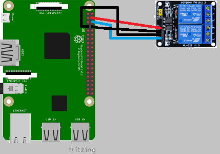
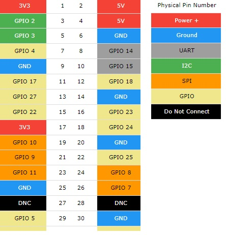

### Controling Raspberry ###

Just a playground to practice with raspberry outputs, but useful to turn on/off some ligths.

A server with socket.io and postgresql  
Instant actions and responses  
Save the state on database to know  
when the server restarts.  
  
Raspberry outputs with relay module  
is easy to connect with few wires.
  
<p align='center'>
      
</p>  
<p align='center'>
    connection diagram
</p>  
<br/>

<p align='center'>
      
</p>
<p align='center'> 
    pin description
</p>  

You can clone this repository in your Raspberry Pi  
then do: ```npm install```  
You need postgres installed and configured  
save on a .env file:  
```DB_PASS```= your_postgres_password  
and create a user "pi" or change user in database.js  
before to do:   ```npm start```  

finally, you got to find the ip of your device and  
use it on the browser.

That's it.
