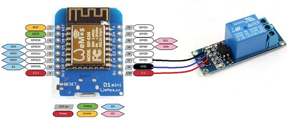
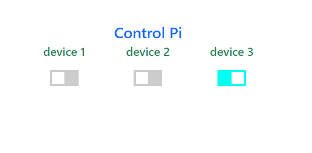

<h1 align='center'> Controling Raspberry </h1>

<h3 align='center'>Just a playground to practice with raspberry outputs, but useful to turn on/off some ligths.</h3>
 

A server with socket.io and postgresql 

Instant actions and responses  

Save the states on database to  

update outputs  

when the server restarts.  

  

Raspberry outputs with doble relay module  

is easy to connect with few wires.

And an Wemos D1 Mini with it's own  

one channel relay connected  

 
  

      

  

    connection diagram

  
 

      

 
    pin description

  

      

 
    Wemos R1 Mini connected

  
 

The raspberry serves the page with switches

two of which activate their own the relays
  

if turns on the third the Wemos receives
  

the order by WiFi what this has to do.
  

 

      

 
    Wemos R1 Mini connected

  
 

You can clone this repository in your Raspberry Pi  

then do:  <b style="color:lightyellow;">npm install</b>  

You need postgres installed and configured  

save on a .env file:  

<b style="color:lightyellow;">DB_PASS</b> = your_postgres_password  

and create a user "pi" or change user in database.js  

before to do:  <b style="color:lightyellow;">npm start</b>

finally, you got to find the ip of your device and  

use it on the browser.

That's it.

